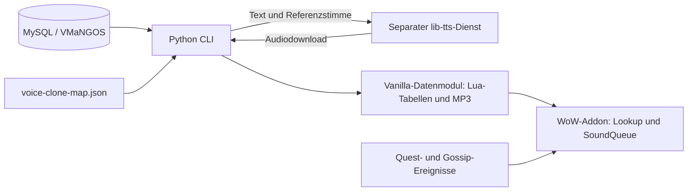

# Projektarchitektur

Das Repository verbindet zwei getrennte Laufzeiten: Offline-Generierung in Python und Wiedergabe im WoW-Client. Das Vanilla-Datenmodul ist die Übergabe zwischen ihnen.

## Bausteine und Einstiegspunkte

| Baustein | Verantwortung |
| --- | --- |
| [cli-main.py](../../cli-main.py) | Argumente, globale Locale und Auswahl der Arbeitsmodi |
| [sql_queries.py](../../tts_cli/sql_queries.py) | MySQL-Abfragen, Locale-Textauswahl, Export nach `output.json`, deutsche Textkorrekturen |
| [tts_cloning.py](../../tts_cli/tts_cloning.py) | Stimmenzuordnung, Text-/Gender-Varianten, Dateinamen, Synthese und Lua-Lookups |
| [length_table.py](../../tts_cli/length_table.py) | Reale MP3-Längen mit mutagen lesen und `sound_length_table.lua` schreiben |
| [init_db.py](../../tts_cli/init_db.py) | Datenbankdump herunterladen, SQL-Dateien und Display-Metadaten importieren |
| [VoiceOver.lua](../../AI_VoiceOver/VoiceOver.lua) | Addoninitialisierung, SavedVariables, Quest-/Gossip-Ereignisse |
| [DataModules.lua](../../AI_VoiceOver/DataModules.lua) | Datenmodule finden/laden, Quest- und Gossip-Dateien auflösen |
| [SoundQueue.lua](../../AI_VoiceOver/SoundQueue.lua) | Warteschlange, Wiedergabe, Pause und Entfernen von Einträgen |
| [Options.lua](../../AI_VoiceOver/Options.lua), [SoundQueueUI.lua](../../AI_VoiceOver/SoundQueueUI.lua) | Optionen, Warteschlangenanzeige und Nutzersteuerung |
| [Compatibility.lua](../../AI_VoiceOver/Compatibility.lua), [Version.lua](../../AI_VoiceOver/Version.lua) | Clientabhängige APIs und Legacy-Unterschiede |
| [Module.lua](../../AI_VoiceOverData_Vanilla/Module.lua) | Registrierung des Vanilla-Datenmoduls und relative MP3-Pfade |

`tts_cli/tts_utils.py` enthält einen älteren ElevenLabs-Pfad. `cli-main.py` importiert den Processor aus `tts_cloning.py`; eine vorhandene Datei oder `ELEVENLABS_API_KEY` belegt deshalb keinen aktiven ElevenLabs-Aufruf dieses CLI-Pfads.

## Datenfluss und Seiteneffekte

1. `init-db` lädt den VMaNGOS-Dump, importiert Daten und ruft deutsche Textkorrekturen auf. Das ist eine Datenänderung, kein Bereitschaftstest.
2. `query_dataframe_for_all_quests_and_gossip` erstellt den DataFrame und überschreibt zugleich `output.json` im Arbeitsverzeichnis.
3. Der Processor lädt `voice-clone-map.json`, behält den Ursprungstext für Gossip-Hashes und erzeugt sprechbare Text-/Gender-Varianten.
4. `interactive` läuft derzeit über alle abgefragten Dialoge und erzeugt Audio seriell. Bereits vorhandene MP3s werden normalerweise übersprungen; Regenerierung kann sie überschreiben.
5. `gen_lookup_tables` schreibt Lua-Zuordnungen und misst vorhandene MP3s. Es erzeugt selbst **kein Audio**.
6. Der Client lädt das Datenmodul bei Bedarf. Dateiname und Dauerntabelle müssen zusammenpassen, damit die Queue eine Aufnahme zuordnen und zeitlich steuern kann.

## HTTP-Vertrag des Clients

`TTSProcessor.tts` verwendet die gemeinsame Basisadresse aus `tts_cli/env_vars.py`, zusammengesetzt aus `TTS_PROTOCOL`, `TTS_HOST` und `TTS_PORT` (Standard: `http://localhost:8000`). Es sendet `POST {TTS_BASE_URL}/api/v1/synthesize` mit `text`, `voice_id`, festem `language: german` und den im Code definierten Syntheseparametern. Es erwartet eine JSON-Antwort mit `file_path` und lädt danach `{TTS_BASE_URL}/api/v1{file_path}`. POST-Timeout: 300 Sekunden; Download-Timeout: 60 Sekunden. Der Rückgabedownload wird unter dem eigenen Quest-/Gossip-Dateinamen als MP3 gespeichert.

Das beschreibt den konsumierten Clientvertrag. Der Server liegt außerhalb des Checkouts; dessen Startbefehl, Authentisierung, Modelldateien und aktuelle Implementierung sind hier nicht verifiziert. Fehler werden im aktuellen Client vielfach als Text zurückgegeben. Ein Prozessende mit Exitcode 0 allein beweist daher keine vollständige Audiogenerierung.

## Bestehende Grenzen

MySQL-Verbindungswerte sind in `env_vars.py` fest codiert, obwohl `.env` geladen wird. Die TTS-Adresse ist über `.env` konfigurierbar; die Synthesesprache bleibt fest codiert. Der Arbeitscontainer startet keine Dienste; `localhost` bezeichnet dort den Container selbst. Die [Entwicklungsanleitung](local-development.md) erklärt die Folgen.

Die Namen-/Hash- und Geschlechtskonventionen sind im [Fachmodell](domain-model.md) beschrieben. Client-TOCs, `addon.xml`-Ladereihenfolge und eingebundene Legacy-Bibliotheken sind Teil des Laufzeitvertrags. Der historische [Retail-Plan](../../RETAIL-PLAN.md) gehört nicht zum belegten Architekturstand.
